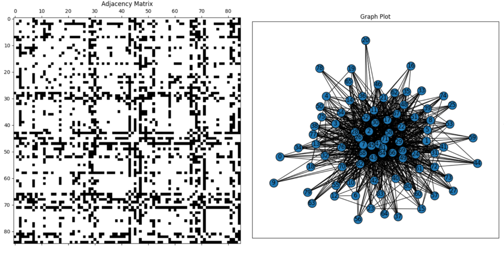
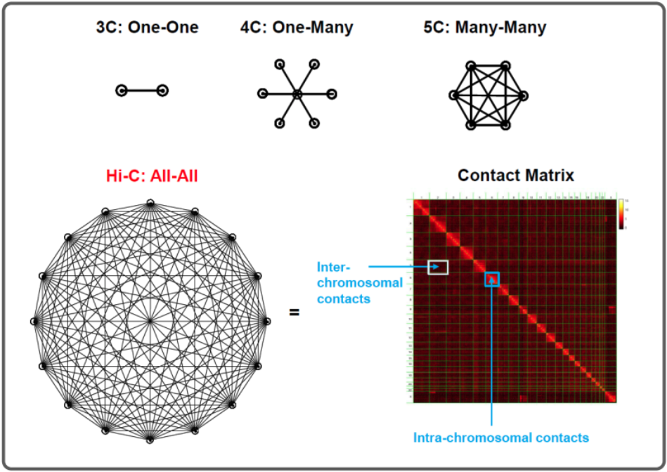

# Mathematics of Biological Networks

Class implementations of Data-guided modeling, analysis, and visualization of networks to understanding and
controlling biological processes. Subjects explored: 

How do cells respond to internal and external stimuli, and how can we intervene or reprogram them?
How do cellular proteins interact with one another?
How do cell and tissue functions emerge from dynamical forces within (genome) and between cells?

  

  

